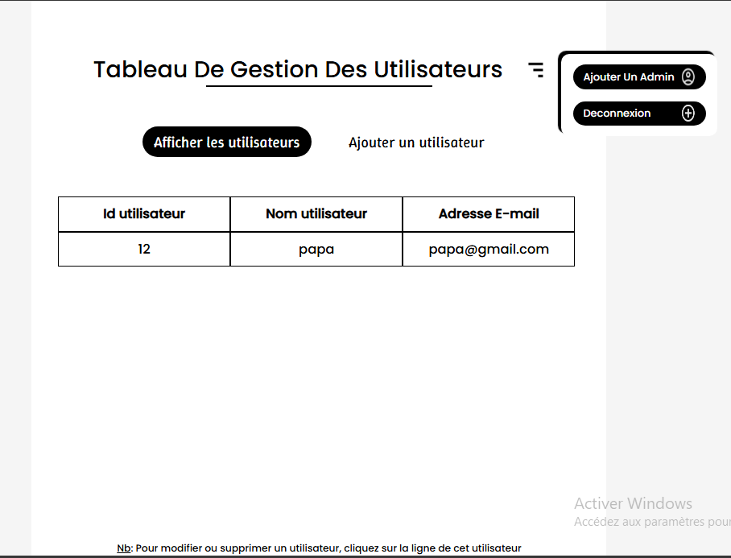

# Panneau Admin de gestion des utilisateurs

Ce panneau permet de gérer les utilisateurs de l'application. Il est accessible uniquement aux administrateurs.



## Description

Ce projet a été mis sur pied en fin de m'exercer sur le PHP en touchant une partie très importante qui est le ```CRUD``` (Create, Read, Update, Delete) des utilisateurs. Il permet de créer, lire, mettre à jour et supprimer des utilisateurs dans une base de données en cliquant sur l'utilisateur en question.
Se connecter en tant qu'administrateur avec les identifiants appropriés.
Utiliser les fonctionnalités du panneau pour gérer les utilisateurs.

## Fonctionnalités

- Création d'utilisateurs
- Lecture des utilisateurs
- Modification des noms et e-mails des utilisateurs
- Suppression des utilisateurs
-Ajout d'un admin s'il n'est pas déja présent
-Connexion en tant qu'admin si __mot de passe__ est correct et email aussi

## Mode d'emploi

### Prérequis

- PHP 7.4 ou supérieur
- Serveur web (Apache, Nginx, etc.)
- Base de données MySQL ou MariaDB
- WampServer ou Xampp ou tout autre serveur local

### Installation

1.__Configurez la base de données__

Pour faire fonctionner ce projet, vous devez d'abord configurer la base de données. Voici les étapes à suivre :

    a. _Créez une nouvelle base de données  dans phpMyAdmin (ou via la ligne de commande). Nommez-la par exemple `mon_projet_db`.

    b. Importez la structure de la base de données. Sélectionnez votre nouvelle base de données dans phpMyAdmin, allez dans l'onglet **"Importer"**, choisissez le fichier `structure_db.sql` de ce projet, puis cliquez sur "Importer".

    Cela créera toutes les tables nécessaires au bon fonctionnement du projet.

2. __Modifier le fichier de connexion__ :  
   Rennomer le fichier __conn_dbb.php.exemple__ en __conn_dbb.php__

1. __Éditer le fichier__ :  
   Remplacer dans `conn_dbb.php` les valeurs suivantes par vos propres informations de connexion à la base de données :  
   - `NOM_UTILISATEUR` → Votre utilisateur MySQL  
   - `MOT_DE_PASSE` → Votre mot de passe  
   - `NOM_BDD` → Le nom de votre base de données que vous avez créée précédemment
   - `localhost` → Si votre serveur de base de données est sur un autre hôte, remplacez-le par l'adresse appropriée.

## Utilisation

1. __Démarrer votre serveur web et votre serveur de base de données__ (par exemple, WampServer ou Xampp).
2. __Placer le dossier du projet__ dans le répertoire racine de votre serveur web (par exemple, `C:\wamp64\www\Panneau_Admin_CRUD_utilisateur` pour WampServer).
3. __Ouvrir votre navigateur web__ et accéder à l'URL du projet (par exemple, `http://localhost/PANNEAU_ADMIN_CRUD_UTILISATEURS/index_admin.php`).
4. __Se connecter en tant qu'administrateur__ :  
   Utilisez les identifiants par défaut (email : `admin@example.com`, mot de passe : `12345`). Après vous être déconnecté, vous pouvez modifier ces identifiants dans la base de données pour plus de sécurité.
5. __Gérer les utilisateurs__ :
   - Pour __ajouter un utilisateur__, cliquez sur le bouton "Ajouter un utilisateur" et remplissez le formulaire.
   - Pour __modifier un utilisateur__, cliquez sur l'utilisateur ensuite sur le bouton "Modifier" de la popup qui s'affiche et remplissez le formulaire.
   - Pour __supprimer un utilisateur__, cliquez sur l'utilisateur ensuite sur le bouton __Supprimer__ de la popup qui s'affiche et __validez__.

   ## Technologies utilisées

- PHP
- MySQL
- HTML
- CSS
- JavaScript

## Auteurs

Fait par [Abdou Mandara](https://github.com/AbdouMandara) lors de son apprentissage du PHP et de la gestion des utilisateurs (```CRUD```) lors de son stage à __GTEC SARL__.
